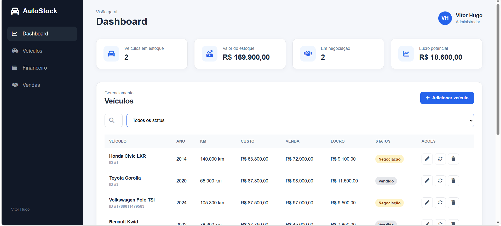
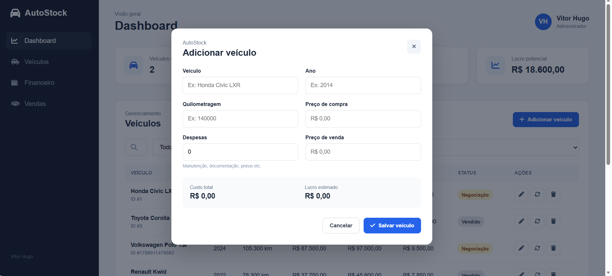
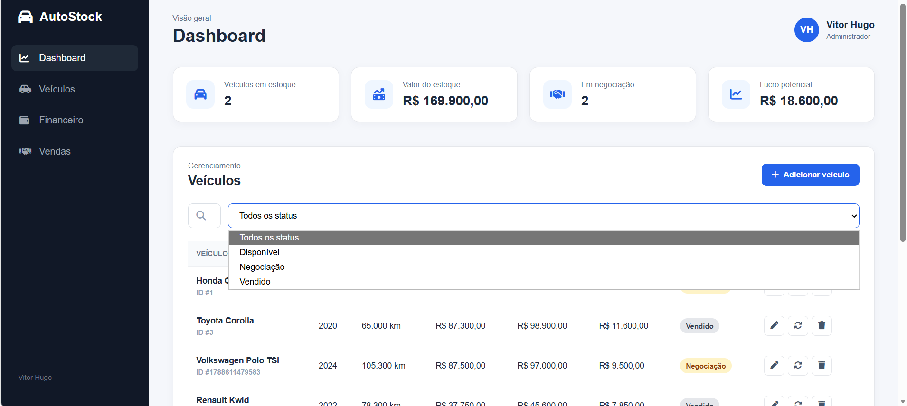

# 🚗 AutoStock

Sistema web para gerenciamento de estoque de veículos.

## 📋 Sobre o projeto

O AutoStock é uma aplicação web desenvolvida para simular o gerenciamento de uma revenda de veículos.

O sistema permite cadastrar veículos, controlar despesas, acompanhar valores de compra e venda e visualizar o lucro estimado de cada veículo.

## 🛠️ Tecnologias utilizadas

- HTML5
- CSS3
- JavaScript
- LocalStorage
- Git
- GitHub

## ✨ Funcionalidades

- Dashboard com informações do estoque
- Cadastro de veículos
- Edição de veículos
- Exclusão de veículos
- Controle de despesas
- Cálculo do custo total
- Cálculo do lucro estimado
- Busca de veículos
- Filtro por status
- Alteração de status
- Persistência dos dados com LocalStorage
- Layout responsivo

## 📸 Demonstração

### Dashboard



### Cadastro de veículo



### Filtro por status



## 📊 Dashboard

O dashboard apresenta informações importantes sobre o estoque:

- Total de veículos
- Valor total do estoque
- Veículos em negociação
- Lucro potencial

## 💰 Cálculos

### Custo total

Valor de compra + despesas.

### Lucro estimado

Valor de venda - custo total.

## 💻 Como executar o projeto

Clone o repositório:

```bash
git clone [https://github.com/vitorhugo03/AutoStock.git](https://github.com/vitorhugo03/AutoStock.git)